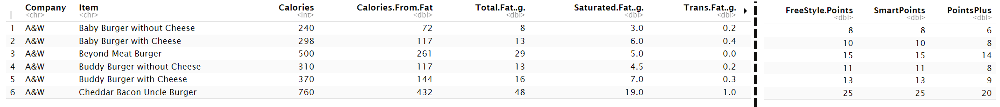

---
output:
  pdf_document: default
  html_document: default
---
```{r, setup, include=FALSE}
require(mosaic)
require(ggformula)
require(readr)
require(mosaic)
require(dplyr)
require(ggplot2)
require(gridExtra)
require(corrplot)

options(scipen = 999)
set.seed(2021)

theme_set(theme_bw()) # change theme for ggplot2
trellis.par.set(theme=theme.mosaic()) # change default color scheme for lattice

knitr::opts_chunk$set(
  tidy=FALSE,    
  size="small")

# Download the images if it doesn't already exist locally
if(!file.exists("burger.png")) {
  download.file("https://raw.githubusercontent.com/ItunuoluwaOlowoye/Data602Project/main/burger.png", 
                destfile = "burger.png", mode = "wb")
}
if(!file.exists("602Table.png")) {
  download.file("https://raw.githubusercontent.com/ItunuoluwaOlowoye/Data602Project/main/602Table.png", 
                destfile = "602Table.png", mode = "wb")
}
```

---
title: "The Fast Food Diet Trap: Analyzing Nutrition and Weight Watchers Points"
author: "Group 4"
date: "2024-10-11"
output: 
  pdf_document:
    fig_width: 6  
    fig_height: 4
  html_document:
    fig_width: 5  
    fig_height: 3
  word_document:
    fig_width: 5  
    fig_height: 3
  urlcolor: blue
  toc: true
  toc_depth: 3
  toc_float: true
header-includes:
- \usepackage{titling}
- \posttitle{\end{center}}
- \usepackage{titlesec}
- \titlespacing*{\subsubsection}{0pt}{*1}{*1.5}
- \pretitle{\begin{center}\huge\includegraphics[width=12cm]{burger.png}\\[\bigskipamount]}
---

\newpage

## Introduction

As graduate students, balancing academic responsibilities and maintaining a healthy lifestyle can become challenging, especially when convenience means grabbing a quick bite to eat for lunch at fast food restaurants like A&W, Diary Queen, McDonald's, Subway or Tim Hortons. They offer easily accessible meals but they also come with concerns about their nutritional content, high calorie and processed fat content.

Beyond graduate life, in today's world, we need to have an important discussion about the potential long-term impacts of these foods on our health. With this in mind, our project aims to address the issue of calorie and nutrient awareness among students, and make it easier for us to navigate the complexities of nutrition and fast food choices.

\vspace{6pt}
### Dataset
Our dataset provides a breakdown of the nutrient and calorie value of items on the menu of selected fast-food restaurants. However, for the scope of this project, the focus is on three key nutrients: Fat (g) (including Trans Fat (g)), Protein (g), and Carbohydrate (g). 

This dataset also contains Weight Watcher Points for each menu item. The [Weight Watcher Points](https://www.weightwatchers.com/ca/en/) system is a program that enables people to easily track their diet and understand the nutrition implications of their fast food choices. People who join the Weight Watcher Program are given a maximum daily and weekly allowance of points. As you eat, you use up points, and once you hit zero, you should stop eating for the day. There are three types of Weight Watchers Points systems (WeightWatchers, n.d.):

1. *Plus Points:* assigns points based on calories and nutrition to help encourage healthier food choices.

2. *FreeStyle Points:* is the most flexible program that allows you to eat up to 200 foods without counting them towards daily points, while making activity a key part of your life.

3. *Smart Points:* uses calories, fats, and fiber to set points, with high-fiber foods costing fewer points, encouraging healthier, more filling choices. You can also rollover a set number of SmartPoints from previous days.

There are 745 rows and 28 columns in total, with 25 of those columns containing numeric data.

Below is a snippet of our dataset:

{height=70px}

We initially sourced our data from [Kaggle](https://www.kaggle.com/datasets/joebeachcapital/fast-food). Within the Kaggle dataset, we noticed that the Weight Watcher Points in this data were more than the actual Weight Watcher Points obtainable. We also noticed that the Weight Watcher Points were oddly similar to the value of the calories for each menu item.

To solve this, we went to the original website where this information was hosted which is [Fast Food Nutrition's](https://fastfoodnutrition.org/ca/) website. We selected five Canadian fast food restaurants (A&W, Diary Queen, McDonald's, Subway, and Tim Hortons) from this site and webscraped their nutrition and weight watcher points information using Python. The webscrapping codes are available [here](https://github.com/ItunuoluwaOlowoye/Data602Project/blob/main/fast_food_data_mining.ipynb). We then updated our code to reflect this new data.

\vspace{12pt}
## Research Questions
For this project, we will be exploring three research questions:

1. What is the relationship between calorie content and the three major nutrients: fat, carbohydrates, and protein, in various food items?
2. Is there a significant difference in the average trans fat content of menu items between A&W and Subway?
3. What is the relationship between calorie content and Plus Points across all listed companies?

Below, we will discuss the preliminary **exploratory data analysis (EDA)**, that informed the development of our research questions.

### Question 1: *What is the relationship between calorie content and the three major nutrients: fat, carbohydrates, and protein, in various food items?*:

#### Relationship between Calories and Other Nutrients

```{r, warning=FALSE, message=FALSE, include=FALSE}
fast_food_df = read.csv('FastFoodNutritionScraped20241011V2.csv')

# create plot of calories vs total fat
cal_fat = ggplot(fast_food_df, aes(x=Total.Fat..g., y=Calories)) +
  geom_point(alpha=0.5, color='blue') +
  geom_smooth(method = 'lm', se=FALSE, color='red', formula = 'y ~ x') +
  labs(title = "Fat Content vs. Calories",
       x = "Total Fat (g)", y = "Calories")

# create plot of calories vs carbohydrates
cal_carb = ggplot(fast_food_df, aes(x=Total.Carbohydrates..g.,
                                    y=Calories)) +
  geom_point(alpha=0.5, color='blue') +
  geom_smooth(method = 'lm', se=FALSE, color='red', formula = 'y ~ x') +
  labs(title = "Carbs Content vs. Calories",
       x = "Carbohydrates (g)", y = "Calories")

# create plot of calories vs protein
cal_prot = ggplot(fast_food_df, aes(x=Protein..g., y=Calories)) +
  geom_point(alpha=0.5, color='blue') +
  geom_smooth(method = 'lm', se=FALSE, color='red', formula = 'y ~ x') +
  labs(title = "Protein Content vs. Calories",
       x = "Protein (g)", y = "Calories")

# create plot of calories vs sodium
cal_sodium = ggplot(fast_food_df, aes(x=Sodium..mg., y=Calories)) +
  geom_point(alpha=0.5, color='blue') +
  labs(title = "Sodium Content vs. Calories",
       x = "Sodium (mg)", y = "Calories")
```

```{r, message=FALSE, warning=FALSE}
grid.arrange(cal_fat, cal_carb, cal_prot, cal_sodium, ncol=2)
```

Calories are highly correlated with three major nutrients: fat, carbohydrates, and protein. The higher the content of these nutrients in food, the more calories it contains. Notably, some menu items have 0g of one of these nutrients but still possess a high caloric value. This suggests a multilinear relationship between calories and all three nutrients, rather than a simple linear relationship with any single nutrient, which we will address with a **multilinear regression analysis**.

\vspace{6pt}
**Non-focal observations:**

There seems to be two linear trends in the relationship between Calories and Sodium, which almost mimics the trend in Calories and Protein. Sodium is primarily contained in salt and spices. This could imply that the salted items on the menu are generally proteins.

\vspace{6pt}
### Question 2 - *Is there a significant difference in the average trans fat content of menu items between A&W and Subway?*:

**Processed (Bad) Fats Distributions in Each Restaurant**

The types of fats found in food include: 

**Unsaturated Fat**: These are the good fat which doctors say should be the fat people eat most. They come as liquid oils instead of solid fats. On food packages, they are listed as mono or poly unsaturated fats.

**Saturated Fat**: These fats come from animals and are generally solid. They contain "bad" cholesterol and can contribute to heart disease. It is recommended that they make up less than 10% of dail caloric intake. Examples include whole-fat milk, butter, high-fat cheeses etc.

**Trans Fat**: These are the worst fats, and the FDA is forcing food companies to phase them out. They form when hydrogen is added to vegetable oil. This is done to increase shelf life but are bad for our health. Examples of food more likely to contain trans fat include stick margarine, pie crusts, ready-to-use frosting, some microwave popcorn and frozen pizza, etc.

We aim to assess the content of these unhealthy Trans fats across various restaurants; therefore, we will examine the trans fat content of menu items from these different establishments.

\vspace{4pt}

#### Trans Fat Content by Restaurant

```{r, include=FALSE}
# visualization to see how trans fat is different based on company
trans_fat_violin_plot = ggplot(fast_food_df,
                               aes(x = Company,y = Trans.Fat..g.,
                                   fill = Company)) +
  geom_violin(alpha = 0.7) +
  geom_boxplot(width = 0.1, fill = "white", color = "black") +
  labs(title = "Violin Plot of Trans Fat Content by Restaurant",
       x = "Company", y = "Trans Fat (g)", fill = "Company") +
  theme_minimal()
```

```{r, message=FALSE, warning=FALSE}
print(trans_fat_violin_plot)
```

```{r}
companies = unique(fast_food_df$Company)
for (company in companies) {
  cat("Favstats for", company, ":\n")
  stats = favstats(filter(fast_food_df, Company == company)$Trans.Fat..g., na.rm = TRUE)
  print(stats)
}
```

It looks like these companies are making efforts to phase out Trans Fat since their central tendencies are less than 0.5g. All of these companies have outliers with items that have more than 1g of trans fat.

McDonald's has the highest median trans fat content compared to the others. The median trans fat content for A&W and Subway is closest to 0g, but which one has less trans fat content? We can test this hypothesis later on. Perhaps we can consider menu items from A&W and Subway as a "healthier" alternative to McDonald's.

\vspace{6pt}

### Question 3 - *What is the relationship between calorie content and Weight Watcher Plus Points across all listed companies?*:

**Correlations between Selected Nutrients, Calories, and Weight Watcher Points**

There are three categories of Weight Watcher Points: Freestyle Points, Smart Points, and Plus Points.

```{r, include=FALSE}
# create numeric df
numeric_df <- dplyr::select(fast_food_df, Calories, Total.Fat..g.,
                            Sodium..mg., Total.Carbohydrates..g.,
                            Protein..g., FreeStyle.Points, SmartPoints,
                            PointsPlus)

# Compute correlation matrix
cor_matrix <- cor(numeric_df, use = "complete.obs", method='pearson')
```

```{r}
# Heat map of the correlation matrix
corrplot(cor_matrix, method = "color", type = "upper", tl.col = "black",
         tl.srt = 45,
         col = colorRampPalette(c("darkolivegreen3", "white",
                                  "aquamarine4"))(200),
         addCoef.col = "black", addCoefasPercent = TRUE)
```

From the correlation plot, we see that Calories are highly correlated with Fat and Carbs, with medium correlation to Proteins.

For the Weight Watcher Points categories:
1. *Freestyle Points*: Highly correlated with calories and carbohydrates.
2. *SmartPoints*: Highly correlated with Calories and Carbohydrates.
3. *PointsPlus*: Most correlated with Calories. Good correlations with carbs and fat.

Since all the Weight Watchers point categories are correlated with calories, we will take a closer look at this relationship.

#### Relationships between Weight Watcher Points and Calories.

```{r, message=FALSE, warning=FALSE}
# calories vs freestyle
fsp = ggplot(fast_food_df,
             mapping = aes(x = Calories, y = FreeStyle.Points)) + 
  geom_point() +
  geom_smooth(mapping = aes(group = Company, color = Company),
              show.legend = TRUE, method = 'loess', formula = 'y~x')  +
  labs(title = "Scatter Plot of Calories vs. Weight Watchers Freestyle Points",
       x = "Calories", y = "Freestyle Points", color = "Company")

# calories vs points plus
pp = ggplot(fast_food_df,
             mapping = aes(x = Calories, y = PointsPlus)) + 
  geom_point() +
  geom_smooth(mapping = aes(group = Company, color = Company),
              show.legend = TRUE, method = 'loess', formula = 'y~x')  +
  labs(title = "Scatter Plot of Calories vs. Weight Watchers Plus Points",
       x = "Calories", y = "Plus Points", color = "Company")

# calories vs smart points
sp = ggplot(fast_food_df,
             mapping = aes(x = Calories, y = SmartPoints)) + 
  geom_point() +
  geom_smooth(mapping = aes(group = Company, color = Company),
              show.legend = TRUE, method = 'loess', formula = 'y~x')  +
  labs(title = "Scatter Plot of Calories vs. Weight Watchers Smart Points",
       x = "Calories", y = "Smart Points", color = "Company")

```

```{r, message=FALSE, warning=FALSE}
print(fsp)
```

The calories of menu items in these companies are positively correlated with the Freestyle Points but McDonald's trend deviate slightly from that of A&W, Dairy Queen, and Subway.

```{r, message=FALSE, warning=FALSE}
print(pp)
```

The calories of menu items in these companies are positively correlated with the Plus Points and all listed restaurants follow the same trend.

```{r, message=FALSE, warning=FALSE}
print(sp)
```

Similar to the Freestyle Points, the calories of menu items in these companies are positively correlated with the Freestyle Points but McDonald's trend deviate slightly from that of A&W, Dairy Queen, and Subway.

\vspace{12pt}
## Application of Hypothesis Testing and Regression Analysis to Address Our Research Questions

### Question 1: What is the relationship between calorie content and the three major nutrients: fat, carbohydrates, and protein, in various food items?

#### Multivariate Regression Analysis

**Carbohydrates, Fat, Protein and Calories**

We identified that calories were highly correlated with fat, protein, and carbohydrates. We can create a multi-linear regression analysis between these nutrients and the calories.

First we can recalculate the correlation coefficient between these nutrients and Calories.

```{r, include=FALSE}
fat_cal_cor = cor(fast_food_df$Total.Fat..g., fast_food_df$Calories,
                  use='complete.obs', method = 'pearson')
prot_cal_cor = cor(fast_food_df$Protein..g., fast_food_df$Calories,
                  use='complete.obs', method = 'pearson')
carb_cal_cor = cor(fast_food_df$Total.Carbohydrates..g., 
                   method = 'pearson',
                   fast_food_df$Calories, use='complete.obs')
```
```{r}
cat("The linear correlation between calories and fat is", fat_cal_cor,
    "\nthat of calories and protein is", prot_cal_cor,
    "\nand that of calories and carbohydrates is", carb_cal_cor)
```

Next, we visualize and build a multi linear regression model.

```{r, include=FALSE}
fat = ggplot(fast_food_df, mapping = aes(x = Total.Fat..g.,
                                         y = Calories)) + 
  geom_point() +
  stat_smooth(geom='smooth', method = 'lm', formula = 'y~x')  +
  labs(title = "Fat vs. Calories",
       x = "Total Fat (g)", y = "Calories")
carbs = ggplot(fast_food_df, mapping = aes(x = Total.Carbohydrates..g.,
                                           y = Calories)) + 
  geom_point() +
  stat_smooth(geom='smooth', method = 'lm', formula = 'y~x')  +
  labs(title = "Carbohydrates vs. Calories",
       x = "Total Carbohydrates (g)", y = "Calories")
protein = ggplot(fast_food_df, mapping = aes(x = Protein..g.,
                                             y = Calories)) + 
  geom_point() +
  stat_smooth(geom='smooth', method = 'lm', formula = 'y~x')  +
  labs(title = "Protein vs. Calories",
       x = "Protein (g)", y = "Calories")
ml_reg = lm (Calories ~ Total.Carbohydrates..g. + Protein..g. +
               Total.Fat..g., data=fast_food_df)
```
```{r}
grid.arrange(fat, carbs, protein, ncol=3)
print(ml_reg)
```

Based on the multi linear regression model:

$\widehat{y} = 5.516 + 3.847C + 4.204P + 8.643F$ where $\widehat{y}$ is the predicted Calories, C is carbohydrate content, P is the protein content, and F is the fat content. 

Next, we check the significance of the model coefficients.
```{r}
round(summary(ml_reg)$coefficients[, "Pr(>|t|)"], 4)
```

The p-values for the intercept (0.04) and all model (0) coefficients are less than 0.05, indicating that all are significant

**Essentially, for every 1g of carbohydrates, you can expect to add roughly 4 calories in a menu item, for every 1g of protein, you expect to add 4 calories, and for every 1g of Fat, you expect to add, you can expect to lose roughly 3 of your Weight Watchers Plus Points.**

Finally, we visualize the residual plots.
```{r}
plot(ml_reg, which=1)
plot(ml_reg, which=2)
```

Since we have outliers in the plot, we will remove these outliers using a cut-off point of residuals greater than 2 and plot these residual graphs again without the outliers.

```{r, include=FALSE}
residuals <- rstandard(ml_reg)  # residuals
outlier_index <- which(abs(residuals) > 2)  # Find residuals with absolute value > 2 (common cutoff for outliers)
non_outlier_index <- setdiff(1:nrow(fast_food_df), outlier_index)  # Indices without the outliers
```
```{r}
plot(fitted(ml_reg)[non_outlier_index], 
     residuals[non_outlier_index],
     xlab = "Fitted values", 
     ylab = "Residuals",
     main = "Residuals vs Fitted (Without Outliers)")
abline(h = 0, col = "red")

qqnorm(residuals[non_outlier_index], 
       main = "Q-Q Plot (Without Outliers)", 
       xlab = "Theoretical Quantiles", 
       ylab = "Standardized residuals",
       pch = 20)
qqline(residuals[non_outlier_index], col = "red")
```

The residuals show no pattern and pass the test of independence (Residuals vs Fitted). However, they fail the test of normality.

\vspace{6pt}
### Question 2 :What is the relationship between calorie content and the three major nutrients: fat, carbohydrates, and protein, in various food items?

**HYPOTHESIS TESTING**

**State the hypothesis**

We identified in the EDA that the trans fat content of menu items in A&W and Subway are closer to 0g than other restaurants. We want to test and see whether the trans fat in menu items of both companies are equal, on average.

1. Null Hypothesis(Ho) - Mean Trans Fat of menu items in A&W and Subway are equal. i.e.$\mu_{aw}$ = $\mu_{dq}$

2. Alternative Hypothesis(H1) - Mean Trans fat of menu items in A&W and Subway are not equal i.e.$\mu_{aw}$ $\neq$ $\mu_{dq}$

First, check the distribution of Trans Fat.

```{r, include=FALSE}
hist_tf = ggplot(fast_food_df, aes(x = Trans.Fat..g.)) +
geom_histogram(bins=20, fill = "skyblue", color = "black", alpha = 0.7) +
labs(title = "Histogram of Trans Fat Distribution",
x = "Trans Fat (g)",
y = "Frequency")
```

```{r, warning=FALSE}
print(hist_tf)
```

As the data is right skewed and not normally distributed, we will use bootstrapping as a non-parametric approach and permutation test as a parametric approach to test the hypothesis.

##### Bootstrapping

```{r, include=FALSE}
# splitting the data based on company
aw_data = fast_food_df$Trans.Fat..g.[fast_food_df$Company == 'A&W']
dq_data = fast_food_df$Trans.Fat..g.[fast_food_df$Company == 'Subway']
# bootstrap test
n = 1000
b = do(n)*(mean(resample(aw_data,replace = TRUE)) - mean(resample(dq_data,replace = TRUE)))
```

```{r, warning=FALSE}
ggplot(b, aes(x=result)) + geom_histogram(fill='blue', bins=20) +
  labs(title = 'Mean difference in Trans Fat',
       subtitle = 'Between A&W and Subway',
       x = 'Mean Difference', y='Frequency')

# 95% confidence interval
quantile(b$result, c(0.025,0.975))
```

##### Permutation test

```{r, include=FALSE}
# observed test statistic
observed_diff = mean(aw_data) - mean(dq_data)
# combine both data in to one
aw_length = length(aw_data)
all <- c(aw_data, dq_data)
dq_start = aw_length + 1
all_length = length(all)
# Decide number of permutations
n_perm <- 1000 # this is not the total number of permutations. This is only a portion of it.
# empty vector to store permutation test statistics
perm_test_stats <- numeric(n_perm)
# Permutation test
for (i in 1:n_perm) {
# Permute the menu items
permuted_menu <- sample(all)
# Calculate the test statistic for the permuted data
perm_aw <- permuted_menu[1:aw_length]
perm_dq <- permuted_menu [dq_start:all_length]
perm_test_stats[i] <- mean(perm_aw) - mean(perm_dq)
}
# Calculate the p-value
p_value = mean(perm_test_stats >= observed_diff)
```
```{r}
# Display the results from permutation test
cat("Permutation Test p-value:", p_value)
```

**Result of the hypothesis testing:**

Given that the p-value is 0.133, we do not have sufficient evidence to reject the null hypothesis at the 5% significance level. Since the confidence interval includes zero, this further supports our null hypothesis.

This means that we do not have evidence to conclude that the mean trans fat content of menu items in A&W and Subway is different.

\vspace{6pt}
### Question 3: What is the relationship between calorie content and Plus Points across all listed companies?

#### Univariate Regression Analysis

**Calories and Weight Watchers Plus Points Calories**

From the EDA, since the Calories vs. Plus Points follow the same trend for all listed companies, we can create a regression analysis between the Calories and the Plus Points.

First we can recalculate the correlation coefficient between Calories and Plus Points.

```{r}
cor(fast_food_df$Calories, fast_food_df$PointsPlus, use='complete.obs',
    method = 'pearson')
```
There is a strong positive linear correlation between Calories and Plus Points.

Next, we visualize the regression line and build a simple linear regression model.

```{r, warning=FALSE}
ggplot(fast_food_df, mapping = aes(x = Calories, y = PointsPlus)) + 
  geom_point() +
  stat_smooth(geom='smooth', method = 'lm', formula = 'y~x')  +
  labs(title = "Scatter Plot of Calories vs. Weight Watchers Plus Points",
       x = "Calories", y = "Plus Points")
reg = lm (PointsPlus ~ Calories, data=fast_food_df)
print(reg)
```

Based on the simple linear regression model:

$\widehat{y} = 0.009975 + 0.027144X$ where $\widehat{y}$ is the predicted Weight Watchers Plus Points and X is the caloric value of the menu item. 

Next, we check the significance of the model coefficients.
```{r}
summary(reg)$coefficients[, "Pr(>|t|)"]
```
The p-value of the intercept is greater than 0.05, so the intercept model coefficient $\beta_0$ is insignificant.

The p-value of the calories (independent variable) is less than 0.05, so the independent variable model coefficient $\beta_1$ is significant.

Since, the model coefficient of the calories is significant, we can compute a 95% confidence interval for this model coefficient.

```{r}
beta_1_CI = confint(reg, "Calories", level=0.95)
cat("We are 95% confident that the model coefficient of the Calories is
    in the range (",
    beta_1_CI[1], ",", beta_1_CI[2], ")")
```

**Essentially, for every 100 calories present in a menu item, you can expect to lose roughly 3 of your Weight Watchers Plus Points.**

Finally, we visualize the residual plots.
```{r}
plot(reg, which=1)
plot(reg, which=2)
```
Again, we remove the outliers and regenerate the plot.
```{r, include=FALSE}
residuals <- rstandard(reg)  # residuals
outlier_index <- which(abs(residuals) > 2)  # Find residuals with absolute value > 2 (common cutoff for outliers)
non_outlier_index <- setdiff(1:nrow(fast_food_df), outlier_index)  # Indices without the outliers
```
```{r}
plot(fitted(reg)[non_outlier_index], 
     residuals[non_outlier_index],
     xlab = "Fitted values", 
     ylab = "Residuals",
     main = "Residuals vs Fitted (Without Outliers)")
abline(h = 0, col = "red")

qqnorm(residuals[non_outlier_index], 
       main = "Q-Q Plot (Without Outliers)", 
       xlab = "Theoretical Quantiles", 
       ylab = "Standardized residuals",
       pch = 20)
qqline(residuals[non_outlier_index], col = "red")
```

The residuals show no pattern and pass the test of independence (Residuals vs Fitted). From the Q-Q plot however, they fail the test of normality.

\begin{center}
**Applying the Weight Watchers Points System Calculator**
\end{center}

```{r, include=FALSE}
plus_points_summary = fast_food_df %>%
     group_by(Company) %>%
     summarize(
         minimum_pp  = min(`PointsPlus`, na.rm = TRUE),
         median_pp = median(`PointsPlus`, na.rm = TRUE),
         mean_pp = mean(`PointsPlus`, na.rm = TRUE),
         max_pp = max(`PointsPlus`, na.rm = TRUE)
     )
```
```{r, warning=FALSE}
print(plus_points_summary)
```

Since we do not have the Weight Watcher Points of Tim Hortons, we can use the regression analysis between calories and Weight Watcher Plus Points to predict the points value for items in Tim Hortons' menu provided that the calorie values of items in the Tim Hortons menu are within the same range as those from the other restaurants used in the prediction.

```{r, include=FALSE}
# extract Tim Hortons Data
th = filter(fast_food_df, Company == "Tim Hortons")
# remove Tim Hortons data
not_th = filter(fast_food_df, Company != "Tim Hortons")
```

```{r}
cat("The minimum calories from restaurants other than Tim Hortons is",
    min(not_th$Calories), "\n and the maximum is", max(not_th$Calories))
cat("\nThe minimum calories from Tim Hortons is",
    min(th$Calories), "\n and the maximum is", max(th$Calories))
```
Since the caloric value of items in Tim Hortons' menu is within the range of those used in the regression model, we can predict the Weight Watchers Plus Points for  all items in Tim Hortons' menu.

```{r}
# predict the plus points
model_coeff = summary(reg)$coefficients[, "Estimate"]

# point estimate prediction
th$PointsPlus <- model_coeff[1] + model_coeff[2] * th$Calories

# predictions at 95% confidence interval
th_pp_pred = predict(reg, newdata = data.frame(Calories = th$Calories), interval = "confidence", level = 0.95)

# visualize the predicted Plus Points distribution
hist(th$PointsPlus, main='Distribution of Predicted Plus Points',
     xlab = "Predicted Plus Points")
```

This distribution shows that most menu items are predicted to have low Plus Points (0-10), showing a majority of healthier options. As the Plus Points increase, the frequency of items significantly decreases, suggesting fewer high-calorie options.

## References
\vspace{4pt}
1. https://www.weightwatchers.com/ca/en/article/all-about-ww-freestyle
2. https://www.ctvnews.ca/health/the-difference-between-trans-fats-saturated-fats-and-unsaturated-fats-1.2426233?cache=piqndqvkh
3. https://www.statology.org/residual-plot-r/
4. https://www.geeksforgeeks.org/how-to-create-a-residual-plot-in-r/